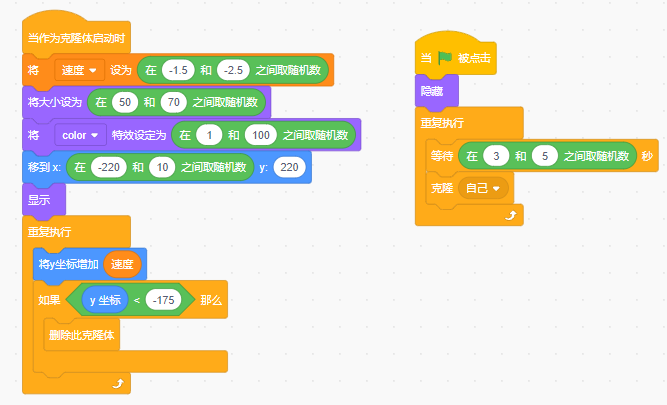
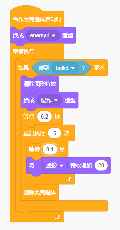

# scratch全面飞机大战

# 一、滚动的背景
要求将两张能无缝衔接起来的背景图片，实现由上到下的滚动，让人产生错觉是无限滚动背景。
 

|背景图片1示例|背景图片1示例
|--|--|
|

# 二、添加敌人机1
> 添加一个敌机1角色图片，在程序中要求：
1、每1秒能自己克隆，并在克隆前要随机改变角色的颜色
2、克隆出来的敌机由上而下移动，速度要在-1.2-3之间随机（提示，可以创建一个变量保存随机速度）。
3、克隆出来的敌机起始位置要在屏幕的最上方，并且x轴的位置是随机的。
4、克隆出来的敌机大小要随机，大小范围要求在40-60之间。
5、当克隆出来的敌机移动到屏幕最底的时候要删除克隆体。

# 三、添加敌机2
> 添加一个敌机2角色图片，在程序中要求：
1、点击小绿旗的时候此敌机处于隐藏状态。
2、重复克隆自己，但要求克隆自己的时间是随机的，随机范围在3-5秒之间。
3、克隆出来的敌机由上而下移动，速度要在-1.5到2.5之间随机（提示，可以使用敌机1创建的速度变量保存随机速度）。
4、克隆体的大小要在50与70之间随机。
5、克隆体的颜色特效随机，颜色特效范围要求在1与100之间。
5、当克隆出来的敌机移动到屏幕最底的时候要删除克隆体。

# 四、添加boss敌机
> 添加一个BOSS敌机角色图片，在程序中要求：
1、点击小绿旗的时候此敌机处于隐藏状态。
2、重复克隆自己，但要求克隆自己的时间是随机的，随机范围在30-50秒之间。
3、克隆体的大小要在60与90之间随机。
4、要求boss敌机的y轴小于70的时候保持向下移动，速度为-2，否则就左右移动（碰到边缘就反弹），速度为2。

# 五、添加英雄机1

> 添加一个英雄机1角色图片，在程序中要求：
1、英雄机要求跟随鼠标移动。
2、英雄机要在所有角色前面

# 六、英雄机常规子弹

> 添加一个英雄机常规子弹角色图片，在程序中要求：
1、点击小绿旗的时候此敌机处于隐藏状态。
2、每隔0.2秒克隆自己
3、克隆体在显示前要移动到英雄机处。
4、克隆体重复向前移动，速度为10。
5、如果碰到舞台边缘就删除克隆体。

# 七、打掉敌机1
添加敌机1的爆炸造型图片，在程序中要求：
|造型图片|程序要求|示例
|--|--|--|
|1、当克隆体启动时将敌机的造型设置为常规状态。 2、当碰到【英雄机常规子弹】时切换到爆炸造型，并且等待0.2秒。 3、注意以上切换造型前要清除图形特效（对比与不清除图形特效的区别）。 4、实现爆炸造型的虚像特效，让爆炸图片慢慢消失，最后删除克隆体。|

# 八、打掉敌机2
添加敌机的爆炸造型图片，在程序中要求：

|造型图片|程序要求|示例
|--|--|--|
|1、当克隆体启动时将敌机的造型设置为常规状 2、添加敌机的生命值变量，默认为5。 3、每次碰到【英雄机常规子弹】生命值会减1。 4、当生命值为小于1时切换到爆炸造型，并且等待0.2秒。 5、实现爆炸造型的虚像特效，让爆炸图片慢慢消失，最后删除克隆体。 |

# 九、打掉BOSS机
导入7张boss机造型图片，并按要求实现程序，如下：

|造型图片|程序要求|示例
|--|--|--|
|1、当克隆体启动时将敌机的造型设置为常规状态。  2、使用生命值变量，默认为20。  3、每次碰到【英雄机常规子弹】生命值会减1，并等待0.1秒（对比不等待的话会发生什么变化）。  4、当生命值为小于1时切换到爆炸造型7，并且等待2秒后删除克隆体。  5、当生命值为小于5时切换到爆炸造型1，接着重复执行5次【切换下一造型】，每次切换等待0.1秒。 |

# 十、打中敌机子弹消失

在英雄机子弹中添加程序：
1、如果碰到敌机1子弹消失（删除克隆体）
2、如果碰到敌机2子弹消失
3、如果碰到BOSS机子弹消失

# 十一、添加分数与英雄机生命值

1、添加【英雄生命值】变量，并将其显示在舞台左上角，当按下小绿旗将此生命值设置为10。
2、添加【得分】变量，并将其显示在舞台右上角，当按下小绿旗将得分设置为0。

参考示例：

3、打掉一个敌机1得分1；打掉一个敌机2，得分3；打掉一个BOSS机得分10。

# 十二、BOSS机发射子弹
先导入BOSS机子弹的角色图片，然后按以下方式实现：
1、按下小绿旗时隐藏这个角色。
2、创建BOSS机子弹x坐标与y坐标变量，并在每次发送子弹前保存当前克隆体的x与y坐标到这两个变量中。
3、当BOOS机启动克隆时每1-5秒（随机）发送一次子弹广播。
4、在BOSS机子弹角色中如果接收到子弹广播，克隆自己。
5、在子弹克隆体启动后次子弹移动到子弹发射的起始坐标（上面记录的x与y坐标变量），并显示。
6、子弹向下移动，每次移动-10。
7、如果子弹碰到边缘则删除此克隆体。
8、如果子弹碰到英雄机，英雄机生命值减1，并且删除子弹克隆体。

|BOSS机程序示例|子弹程序示例
|--|--|
|

# 十三、英雄机发射散弹
1、给英雄机导入5个子弹造型，默认为造型1。
2、当分数达到10时开启2级散弹，并将子弹造型切换为2。
3、当分数达到30时开启3级散弹，并将子弹造型切换为3。
4、当分数达到50时开启4级散弹，并将子弹造型切换为4。
5、当分数达大于100时开启5级散弹，并将子弹造型切换为5。

小提示：散弹可以通过在子弹移动过程中增加或减少横轴实现，几级则要同时克隆几个子弹。

# 十四、英雄机生命延续包
1、导入延续包角色图片：

2、游戏开始时，处于隐藏状态。
3、在20-50秒之间启动克隆。
4、生命延续包从舞台上方往下移动，速度为-5，横轴坐标应该在舞台中随机出现。
5、如果接近下方将删除此克隆体。
6、如果碰到英雄机将给英雄机的生命值增加1，并删除此克隆体。

程序示例：

# 十五、开始与结束
导入LOGO图片与开始点击按钮图片两个角色

1、当小绿旗被点击时显示按钮并让其颜色闪烁变换。
2、点击开始游戏按钮时广播消息【游戏开始】并隐藏此按钮。
3、当接收到消息【游戏结束】时显示此按钮并移动到相应位置，同时也要停止所有脚本。

4、当小绿旗被点击时显示LOGO，并在接收开始消息【游戏开始】时隐藏LOGO。
5、当接收到消息【游戏结束】时显示LOGO，并移动到相应位置。
6、修复之前代码，将所有小绿旗的地方修改成接收到消息【游戏开始】

|开始按钮示例|LOGO示例
|--|--|
|

# 十六、声音处理
1、添加背景音乐。
2、添加英雄机子弹发射音效。
3、添加boss机子弹发射音效。
4、添加所有敌机爆炸音效。

