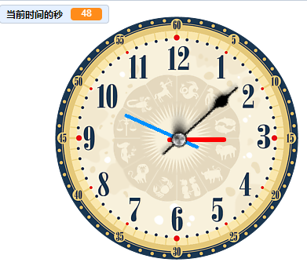
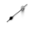

# 表的制作
请制作一个表，秒针，分针，时针的走动与电脑的时间是同步的。

学习目的：
正确判断时针分针秒针之间旋转角度的关系，完成时分秒之间的递进转换
1、深入了解面向的意义。
2、使用系统当前时间。
3、声音的播放。
4、角色的层次编排。
5、乘法的运算。

### 一、导入表盘素材

请在角色中导入表盘图片。

### 二、导入秒针素材并编写程序

1、先将水平调整。
2、点击小绿旗将角色显示最前面，并将方向面向0度。
3、在重复执行中不断的设置秒针的方向（想一想方向应该是当前秒数的多少）
4、调整秒钟旋转的中心点。
5、在重复执行中每隔1秒播放秒针走动的声音。

### 三、实现分针与时针
秒针实现后，分针与时针的原理是一样的，不分针与时针的角色需要自己画出来。